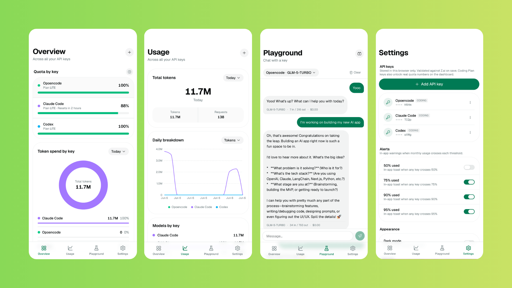

# Z.ai Quota Tracker

A mobile-first dashboard that surfaces your Z.ai (GLM) usage — the same numbers you'd see at `z.ai/manage-apikey/subscription`, plus a built-in playground for testing prompts.

Designed to run as a Telegram Mini App, but works fine as a plain web app too.



---

## What it shows

- **5-hour quota %** with reset countdown, plan tier (`lite`/`pro`/`max`).
- **Search / Reader / Zread** monthly quota (Coding Plan plans).
- **Tokens & requests** over the last 7 or 30 days (line chart + totals).
- **Per-model breakdown** — donut + ranked list — for Today / 7d / 30d.
- **Playground** — pick a model, send a streamed chat completion, see the per-call cost and token breakdown, watch it accumulate in the local usage log.
- **In-app threshold alerts** at 50% / 75% / 90% / 95%, fired whenever any key with a monthly budget crosses a threshold.

Numbers shown on the Overview and Usage tabs come from Z.ai's own monitor endpoints (the ones that power their dashboard), aggregated across every key you've added. Playground-recorded usage is a separate local log for pay-as-you-go tracking with a budget.

---

## Architecture

Single Next.js app, no separate backend.

### Frontend

| Layer | Pick |
| --- | --- |
| Framework | Next.js 16 (App Router) + React 19 |
| Styling | Tailwind v4 + shadcn/ui (radix-luma) |
| Drawer / sheet | vaul (`Drawer` everywhere — preferred over `Dialog` for this mobile-first app) |
| Server cache | TanStack Query |
| Client state | Zustand (`ui-store`, `alerts-store`) |
| Charts | Recharts |
| Icons | `@hugeicons/react` |
| Telegram | `@telegram-apps/sdk-react` (auto-detects, falls back to dev mock) |

### Server-side surface

One Route Handler: `app/api/zai/[...path]/route.ts`. It's a pass-through proxy to Z.ai used to dodge browser CORS. Reads `Authorization` and `x-zai-endpoint` from the incoming request, forwards to one of:

- `https://api.z.ai/api/paas/v4` — standard inference
- `https://api.z.ai/api/coding/paas/v4` — Coding Plan inference
- `https://api.z.ai/api` — monitor endpoints (`/monitor/usage/quota/limit`, `/monitor/usage/model-usage?startTime=…&endTime=…`)

The proxy is stateless. It never reads or stores the key body — only forwards the header.

### Data persistence

Entirely in `localStorage`. There is no database, no auth, no Worker, no D1.

| Key | Holds |
| --- | --- |
| `zai-tracker-keys` | Array of API keys (`{ id, name, endpoint, key, monthlyBudgetCents, … }`) |
| `zai:events:{keyId}` | Append-only Playground call log per key (token counts, cost in cents) |
| `zai-tracker-ui` | Selected key id, usage-invalidation counter |
| `zai-tracker-alerts` | Global threshold toggles + per-key `lastFiredPeriod` |

Plain plaintext. Fine for personal use on a device you control; **not** suitable as a shared hosted service.

---

## How usage numbers are sourced

Z.ai exposes no public "usage / balance" API. The published reference (`docs.z.ai`) covers only inference endpoints. The data on `z.ai/manage-apikey/subscription` is served by **undocumented monitor endpoints under `api.z.ai/api/monitor/…`** that, conveniently, accept the same Bearer API key.

This project uses:

- `GET /api/monitor/usage/quota/limit` → 5-hour token quota %, plan tier, reset time, search/reader/zread quota
- `GET /api/monitor/usage/model-usage?startTime=YYYY-MM-DD HH:MM:SS&endTime=…` → per-day token & call counts, `modelSummaryList`, `modelDataList`

Because these aren't in the public reference, they can change without warning. If the cards ever surface a 4xx/5xx error, that's the first thing to check.

---

## Routes

```
/                Overview   — Per-key quota carousel + Tokens by model aggregated across all keys
/usage           Usage      — Totals + daily breakdown (one line per key), aggregated across all keys
/playground      Playground — Pick model, send prompt, see streamed reply + cost
/settings        Settings   — Manage keys, alert thresholds, dark mode
/models          Models     — Total tokens, per-model ranked list (hidden from nav, still routable)
```

Bottom-tab nav, 4 tabs.

---

## Local setup

```bash
pnpm install
pnpm dev
```

Open `http://localhost:3000`.

1. **Settings → Add API key** → paste your Z.ai key, pick `Standard API` or `Coding Plan`, optionally set a monthly budget. The drawer validates against `/models` before saving.
2. **Overview** populates immediately — your real plan tier and quota, fetched on a 60s refresh.
3. **Playground** — pick a model, send a prompt. Cost gets computed from the local pricing table and appended to the per-key event log.

You can paste multiple keys. Overview and Usage aggregate across all of them; Playground has a key switcher in the top-right.

---

## Scripts

```bash
pnpm dev         # next dev (Turbopack)
pnpm build       # production build
pnpm start       # serve the build
pnpm typecheck   # tsc --noEmit
pnpm lint        # eslint
pnpm format      # prettier --write
```

---

## Telegram Mini App

The app initialises the Telegram SDK on mount (`components/providers/telegram-provider.tsx`) and falls back to a dev user when not running inside Telegram. To wire it up as an actual Mini App:

1. Create a bot via `@BotFather`.
2. `/newapp` → point at your deployed URL.
3. Open it from inside Telegram — the SDK picks up `initData` automatically.

There is no server-side `initData` HMAC validation, because there is no server beyond the proxy. If you ever add auth, that's where it'd go.

---

## Known limits

- The monitor endpoints aren't officially documented. Field names could move under your feet.
- Pay-as-you-go (non-Coding Plan) keys may not return useful monitor data. Set a budget on the key to fall back to Playground-tracked $ instead.
- Playground cost is computed from a hand-maintained price table in `lib/zai-pricing.ts`. Treat as approximate.
- Keys live in plaintext localStorage. Don't expose this app publicly without auth.
- Telegram bot alerts (50/75/90/95) fire as in-app toasts only; there is no backend to push a message into Telegram on your behalf.

---

## Stack

```
Next.js 16 · React 19 · TypeScript 5 · Tailwind v4
shadcn/ui · vaul · Recharts · @hugeicons/react
TanStack Query · Zustand · @telegram-apps/sdk-react
```
