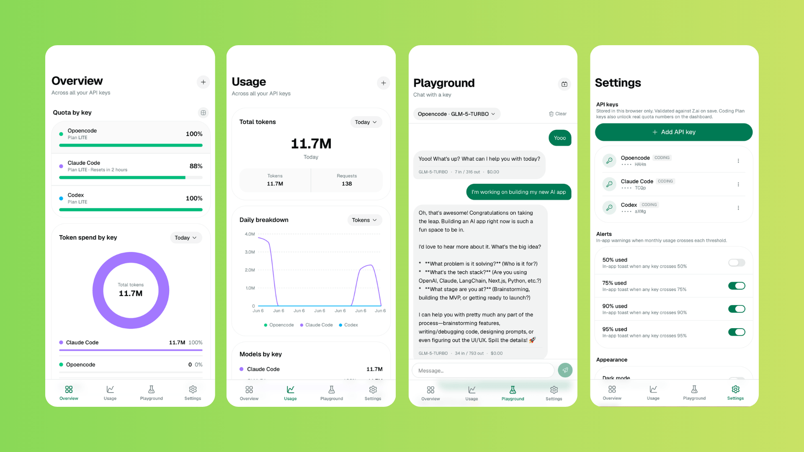

# Z.ai Quota Tracker

A mobile-first dashboard that surfaces your Z.ai (GLM) usage — the same numbers you'd see at `z.ai/manage-apikey/subscription`, plus a built-in playground for testing prompts.

Designed to run as a Telegram Mini App, but works fine as a plain web app too.



---

## What it shows

- **5-hour quota %** with reset countdown, plan tier (`lite`/`pro`/`max`).
- **Search / Reader / Zread** monthly quota (Coding Plan plans).
- **Tokens & requests** over the last 7 or 30 days (line chart + totals).
- **Per-model breakdown** — donut + ranked list — for Today / 7d / 30d.
- **Playground** — pick a model, send a streamed chat completion, see the per-call cost and token breakdown, watch it accumulate in the local usage log.
- **In-app threshold alerts** at 50% / 75% / 90% / 95%, fired whenever any key with a monthly budget crosses a threshold.

Numbers shown on the Overview and Usage tabs come from Z.ai's own monitor endpoints (the ones that power their dashboard), aggregated across every key you've added. Playground-recorded usage is a separate local log for pay-as-you-go tracking with a budget.

---

## Architecture

Single Next.js app. The only server code is a CORS-bypass proxy plus a small authenticated Cloudflare D1 layer that syncs your API keys across devices — identity comes from Telegram inside the Mini App, or from a paired device token anywhere else.

### Frontend

| Layer | Pick |
| --- | --- |
| Framework | Next.js 16 (App Router) + React 19 |
| Styling | Tailwind v4 + shadcn/ui (radix-luma) |
| Drawer / sheet | vaul (`Drawer` everywhere — preferred over `Dialog` for this mobile-first app) |
| Server cache | TanStack Query |
| Client state | Zustand (`ui-store`, `alerts-store`) |
| Charts | Recharts |
| Icons | `@hugeicons/react` |
| Telegram | `@telegram-apps/sdk-react` (auto-detects, falls back to dev mock) |

### Server-side surface

**`app/api/zai/[...path]/route.ts`** — a stateless pass-through proxy to Z.ai used to dodge browser CORS. Reads `Authorization` and `x-zai-endpoint` from the incoming request, forwards to one of:

- `https://api.z.ai/api/paas/v4` — standard inference
- `https://api.z.ai/api/coding/paas/v4` — Coding Plan inference
- `https://api.z.ai/api` — monitor endpoints (`/monitor/usage/quota/limit`, `/monitor/usage/model-usage?startTime=…&endTime=…`)

It never reads or stores the key body — only forwards the header. Note the browser no longer routes `model-usage` through this proxy (see [How usage numbers are sourced](#how-usage-numbers-are-sourced)); the proxy still carries inference and `quota/limit`.

**`app/api/keys/route.ts`** — the API-key sync layer, backed by Cloudflare **D1** (binding `DB`, schema in `migrations/`). Every row is scoped to a user id the *server* established, never one the client claims. `GET` lists; `POST`/`DELETE` are per-key (so a stale client can only touch the row it names); `PUT` is a non-destructive bulk upsert used only by the one-time migration.

**`lib/api-auth.ts`** — the shared gate in front of the D1 routes. Two credentials resolve to the same identity:

| Header | Who sends it | Checked how |
| --- | --- | --- |
| `x-telegram-init-data` | the Mini App | HMAC against `TELEGRAM_BOT_TOKEN` (`lib/telegram-auth.ts`) |
| `authorization: Bearer …` | a paired device | SHA-256 lookup in the `devices` table |

**`app/api/devices/*`** — pairing. `POST /pair` mints a code (Telegram-only), `POST /claim` trades it for a device token (the only unauthenticated route — the code *is* the proof), `GET`/`DELETE` list and revoke (Telegram-only). Device management is deliberately Telegram-only: a leaked device token can read and write your keys, but it can't mint new codes or revoke devices, so it can't entrench itself.

**`app/api/summary/route.ts`** — one number per key (`usedPct`, `worstPct`) for clients that can't run the browser's per-key fan-out, like a tray icon. Calls Z.ai directly rather than through the proxy — there's no browser here to have CORS problems.

**`app/install.ps1/route.ts`** — serves the Windows setup one-liner (see [Linking a Windows device](#linking-a-windows-device)).

### Data persistence

API keys are **D1-authoritative when running in Telegram**, with `localStorage` as an offline cache and instant-load mirror. Outside Telegram (e.g. plain `next dev`) the app degrades to localStorage-only. Everything else stays in `localStorage`.

| Key | Holds |
| --- | --- |
| `zai-tracker-keys` | API-key cache (`{ id, name, endpoint, key, keyLast4, createdAt, lastSyncedAt }`); canonical copy lives in D1 when signed in |
| `zai-tracker-ui` | Selected key id, UI prefs |
| `zai-tracker-alerts` | Global threshold toggles + per-key `lastFired` |

`hooks/use-api-keys.ts` (read + per-key optimistic mutations), `lib/api-keys.ts` (shared storage/network helpers), and `components/providers/key-migration.tsx` (one-time localStorage→D1 push) make up the client side; `normalizeApiKey` in `lib/types.ts` is the single key-shaping function shared by client and server.

Keys are stored in plaintext (localStorage cache + the D1 `key` column); D1 rows are isolated per user but not encrypted at rest. Fine for personal use — treat the bot token and DB as sensitive. Pairing codes and device tokens are the exception — those are hashed, so a database leak can't be replayed as a credential.

---

## How usage numbers are sourced

Z.ai exposes no public "usage / balance" API. The published reference (`docs.z.ai`) covers only inference endpoints. The data on `z.ai/manage-apikey/subscription` is served by **undocumented monitor endpoints under `api.z.ai/api/monitor/…`** that, conveniently, accept the same Bearer API key.

This project uses:

- `GET /api/monitor/usage/quota/limit` → 5-hour token quota %, plan tier, reset time, search/reader/zread quota
- `GET /api/monitor/usage/model-usage?startTime=YYYY-MM-DD HH:MM:SS&endTime=…` → per-day token & call counts, `modelSummaryList`, `modelDataList`

Because these aren't in the public reference, they can change without warning. If the cards ever surface a 4xx/5xx error, that's the first thing to check.

They're also fronted by an Aliyun WAF that discriminates by origin: since August 2026 it answers `model-usage` requests coming from **Cloudflare Worker egress IPs** with a `405` anti-bot page (while `quota/limit` and the inference endpoints pass). Since this app deploys *as* a Worker, fetching through its own proxy made every key's model-usage call fail at once. So `lib/zai-monitor.ts` fetches `model-usage` **straight from the browser** to `api.z.ai` — Z.ai reflects any `Origin` in its CORS headers, so the cross-origin call just works — and falls back to the proxy only when the direct attempt fails at the transport level (non-JSON body, HTTP error status, network failure). A JSON envelope answer (e.g. an expired token) is definitive and not retried.

---

## Routes

```
/                Overview   — Per-key quota carousel + Tokens by model aggregated across all keys
/usage           Usage      — Totals + daily breakdown (one line per key), aggregated across all keys
/playground      Playground — Pick model, send prompt, see streamed reply + cost
/settings        Settings   — Manage keys, linked devices, alert thresholds, dark mode
/models          Models     — Total tokens, per-model ranked list (hidden from nav, still routable)
```

Bottom-tab nav, 4 tabs.

---

## Local setup

```bash
pnpm install
pnpm dev
```

Open `http://localhost:3000`.

1. **Settings → Add API key** → paste your Z.ai key, pick `Standard API` or `Coding Plan`, optionally set a monthly budget. The drawer validates against `/models` before saving.
2. **Overview** populates immediately — your real plan tier and quota, fetched on a 60s refresh.
3. **Playground** — pick a model, send a prompt. Cost gets computed from the local pricing table and appended to the per-key event log.

You can paste multiple keys. Overview and Usage aggregate across all of them; Playground has a key switcher in the top-right.

---

## Scripts

```bash
pnpm dev         # next dev (Turbopack)
pnpm build       # production build
pnpm start       # serve the build
pnpm typecheck   # tsc --noEmit
pnpm lint        # eslint
pnpm format      # prettier --write
pnpm cf:preview  # opennextjs-cloudflare build + wrangler dev (local D1 binding)
pnpm cf:deploy   # opennextjs-cloudflare build + wrangler deploy
```

---

## Deployment

The Next app deploys to Cloudflare via `@opennextjs/cloudflare` (root `wrangler.jsonc`, `pnpm cf:deploy`). The key-sync feature needs two extra pieces of setup:

```bash
# 1. Bot token — used to validate Telegram initData server-side.
wrangler secret put TELEGRAM_BOT_TOKEN          # production
echo "TELEGRAM_BOT_TOKEN=…" > .dev.vars          # local (gitignored)

# 2. D1 database (binding `DB`) + schema.
wrangler d1 create ai-quota                       # once; id goes in wrangler.jsonc
wrangler d1 migrations apply ai-quota --remote    # apply migrations/
```

Device pairing needs `0003_devices.sql` applied before it works.

`next dev` picks up the binding too, via `initOpenNextCloudflareForDev()` in `next.config.ts`. The standalone `warmup-cron/` Worker deploys separately (see `warmup-cron/README.md`).

---

## Telegram Mini App

The app initialises the Telegram SDK on mount (`components/providers/telegram-provider.tsx`) and falls back to a dev user when not running inside Telegram. To wire it up as an actual Mini App:

1. Create a bot via `@BotFather`.
2. `/newapp` → point at your deployed URL.
3. Open it from inside Telegram — the SDK picks up `initData` automatically.

`initData` **is** HMAC-validated server-side (`lib/telegram-auth.ts`) for the D1 routes — that's the trust anchor for per-user key storage, so your keys follow your Telegram account across devices, and it's the root every device token descends from. It requires the bot token as a Worker secret (see Deployment). The rest of the app trusts the client (localStorage-only state needs no validation).

---

## Linking a Windows device

Your keys live in D1 scoped to your Telegram account, so a desktop client needs a way to prove it's you without any Telegram context. It gets one by pairing: the Mini App mints a short-lived code, and the device trades it **once** for a long-lived token it stores locally.

**Settings → Linked devices → Link a device** shows a code plus a ready-made PowerShell one-liner. Paste it into Windows PowerShell:

```powershell
$env:AI_QUOTA_CODE="K7F2-9QMX"; irm https://<your-host>/install.ps1 | iex
```

Or run it without the variable and the script prompts for the code:

```powershell
irm https://<your-host>/install.ps1 | iex
```

The script redeems the code against `/api/devices/claim`, writes the resulting token to `%APPDATA%\ai-quota\config.json`, and then installs the tray client from the latest GitHub release. Set `AI_QUOTA_DEVICE_NAME` to override the name shown in Settings (defaults to `%COMPUTERNAME%`).

Once installed you get a tray icon whose ring fills with your most-used key (green → amber → red at 75% / 90%), a tooltip with the per-key numbers, and a popover on click. Right-click for **Refresh now**, **Open dashboard**, **Start with Windows**, and **Quit**. Source lives in [`desktop/`](desktop/README.md).

> **No release is published yet**, so the install half of the script is currently a no-op — it reports that and exits with pairing saved. Cutting one is a `git tag desktop-v0.1.0 && git push --tags` away; CI builds it on `windows-latest`.

Details worth knowing:

- Codes last **10 minutes**, are **single-use**, and only one is live per account — generating a new one kills the old.
- A code is 8 characters of a base32 alphabet with no `I`/`L`/`O`/`U`, and is normalized before checking, so typing it lowercase, with dashes, or with `O` for `0` all work.
- Only **SHA-256 hashes** of codes and tokens are stored. The plaintext of either never reaches the database.
- Revoking a device in Settings kills its token immediately.

---

## Known limits

- The monitor endpoints aren't officially documented. Field names could move under your feet.
- The browser-direct `model-usage` fetch relies on Z.ai reflecting the app's `Origin` in its CORS responses. If that ever closes, the proxy fallback takes over — and runs straight back into the Worker-egress WAF block described above (Usage/Overview charts would error while quota cards keep working).
- Pay-as-you-go (non-Coding Plan) keys may not return useful monitor data. Set a budget on the key to fall back to Playground-tracked $ instead.
- Playground cost is computed from a hand-maintained price table in `lib/zai-pricing.ts`. Treat as approximate.
- Keys are stored in plaintext (localStorage cache, the D1 `key` column, and `%APPDATA%\ai-quota\config.json` on a paired Windows device). D1 rows are scoped per user but not encrypted at rest — keep the bot token and database private.
- The Windows tray client has never run on real Windows hardware — it's compile-checked and unit-tested on macOS, and no release has been cut yet.
- Telegram bot alerts (50/75/90/95) fire as in-app toasts only; there is no backend to push a message into Telegram on your behalf.

---

## Stack

```
Next.js 16 · React 19 · TypeScript 5 · Tailwind v4
shadcn/ui · vaul · Recharts · @hugeicons/react
TanStack Query · Zustand · @telegram-apps/sdk-react
```
